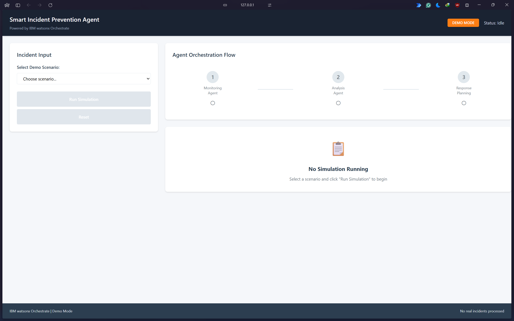
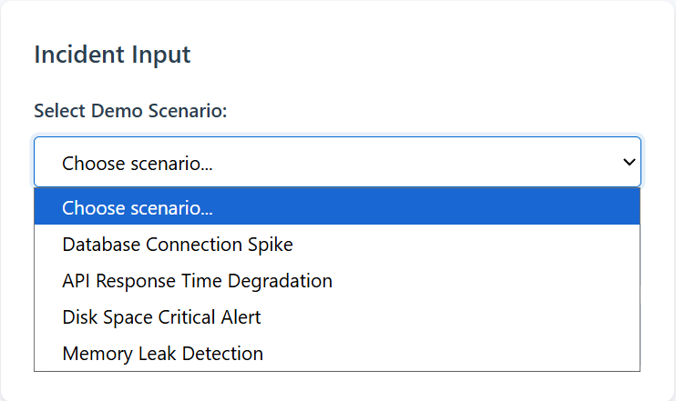
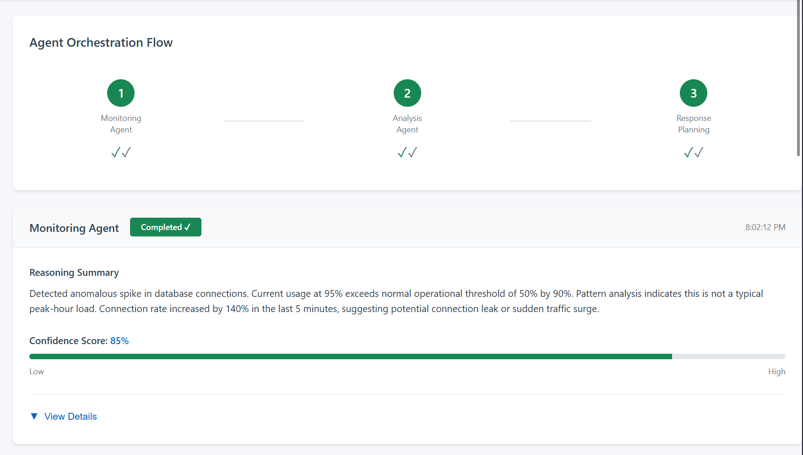
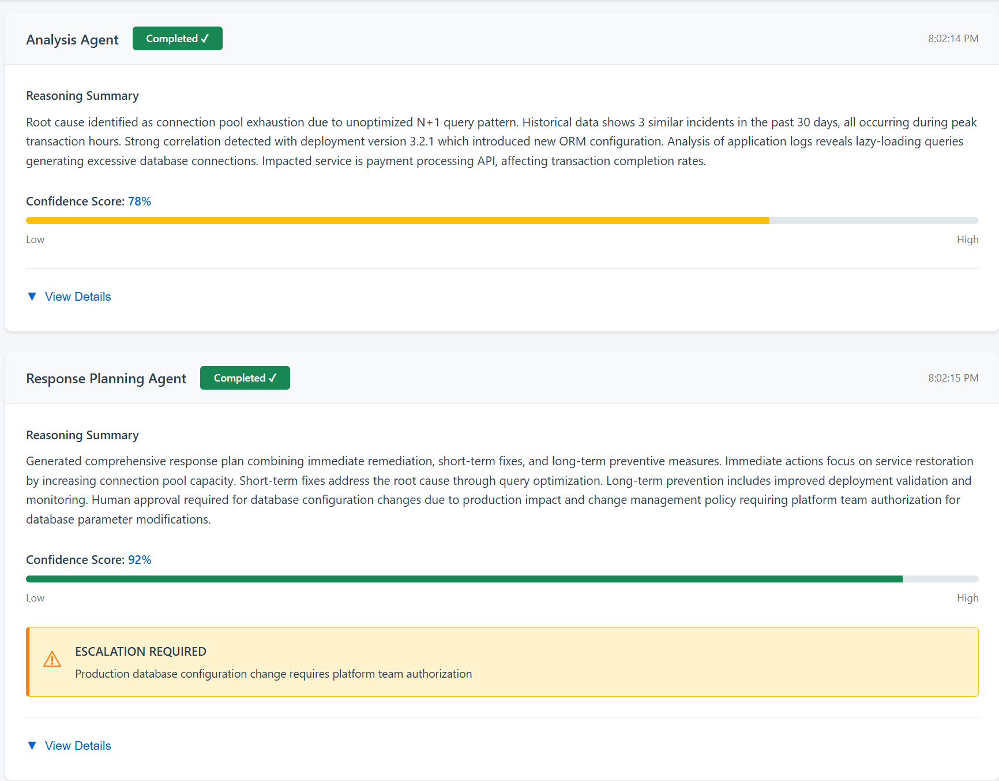
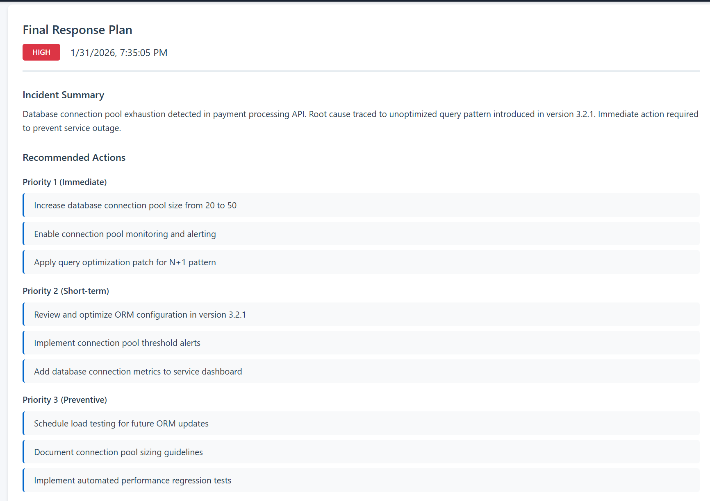
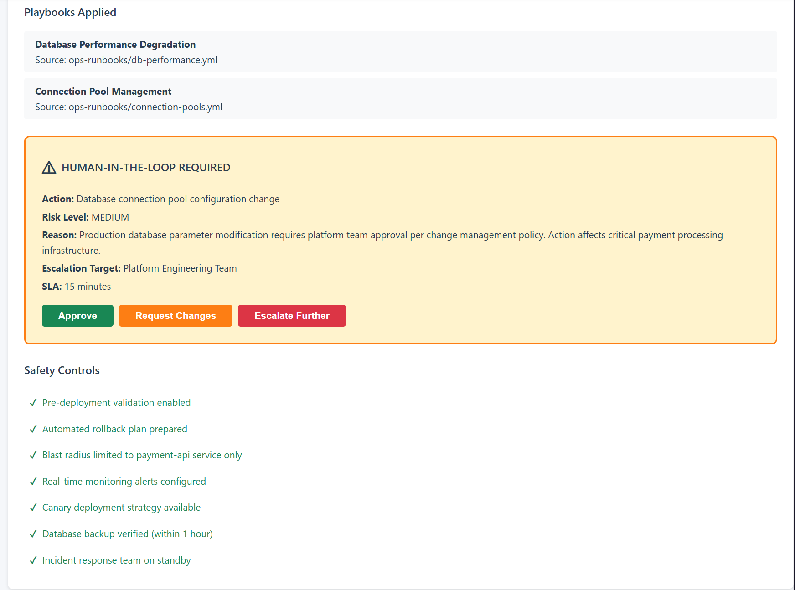

# Smart Incident Prevention Agent

> AI-powered incident management system using IBM watsonx Orchestrate for automated anomaly detection, root cause analysis, and intelligent response planning.



## Overview

A multi-agent AI system that transforms enterprise incident management by automating the detection, analysis, and response workflow while maintaining human oversight for critical decisions. Built with IBM watsonx Orchestrate to demonstrate coordinated agent collaboration with explainable AI principles.

### The Problem

Enterprise operations teams struggle with:
- **Alert fatigue** from hundreds of daily monitoring notifications
- **Delayed root cause analysis** requiring manual correlation of logs, metrics, and deployment history
- **Inconsistent response quality** due to varying engineer approaches and missing safety controls

These inefficiencies increase mean time to resolution (MTTR) and amplify operational risk.

### The Solution

Automated multi-agent workflow orchestrated through IBM watsonx:

1. **Monitoring Agent** → Filters noise, detects anomalies, scores severity
2. **Analysis Agent** → Correlates patterns, identifies root causes, refines assessments
3. **Response Agent** → Generates action plans, evaluates risk, routes escalations
4. **Ticketing Agent** → Creates tickets, triggers automation, updates tracking systems

## Architecture

```
┌─────────────────────────────────────────────────────────┐
│                   PRESENTATION LAYER                    │
│              Web UI + Human Approval Gates              │
└───────────────────────────┬─────────────────────────────┘
                            │
┌───────────────────────────▼─────────────────────────────┐
│                  ORCHESTRATION LAYER                    │
│              IBM watsonx Orchestrate                    │
│    Sequential Execution • State Mgmt • Audit Logs       │
└───────────────────────────┬─────────────────────────────┘
                            │
┌───────────────────────────▼─────────────────────────────┐
│                     AGENT LAYER                         │
│  [Monitoring] → [Analysis] → [Response] → [Ticketing]   │
└───────────────────────────┬─────────────────────────────┘
                            │
┌───────────────────────────▼─────────────────────────────┐
│                     DATA LAYER                          │
│   Alerts • Logs • Historical Incidents • Runbooks       │
└─────────────────────────────────────────────────────────┘
```

### Core Principles

- **Explainability**: Every decision includes reasoning summaries and confidence scores
- **Safety-First**: High-risk actions require human approval based on change management policies
- **Deterministic Flow**: Sequential agent execution ensures reproducible behavior
- **Human-in-the-Loop**: Critical checkpoints for manual oversight and emergency overrides

## Features

### Monitoring Agent
- Statistical anomaly detection with configurable thresholds
- Multi-metric correlation and pattern recognition
- Severity classification (Low/Medium/High/Critical)
- Confidence scoring with reasoning transparency
- Noise filtering for staging environments and maintenance windows

### Analysis Agent
- Historical incident pattern matching using vector similarity
- Deployment timeline correlation for regression detection
- Service dependency impact analysis via graph traversal
- Root cause hypothesis ranking with confidence thresholds
- Severity refinement based on blast radius and business impact

### Response Planning Agent
- Operational runbook mapping for known root causes
- Multi-priority action generation (Immediate/Short-term/Preventive)
- Risk assessment matrix (Low/Medium/High/Critical)
- Intelligent escalation routing based on risk and severity
- Safety control validation and rollback plan verification

### Ticketing Agent *(Optional)*
- ServiceNow/Jira integration for ticket creation
- Workflow automation trigger for approved actions
- Status tracking and audit trail maintenance

## Quick Start

### Prerequisites

- Modern web browser (Chrome, Firefox, Edge)
- Python 3.8+ *(for future agent implementation)*
- IBM watsonx Orchestrate access *(for production deployment)*

### Run Demo UI

```bash
# Clone repository
git clone <repository-url>
cd "Smart Incident Prevention Agent"

# Option 1: Start local HTTP server (recommended)
cd demo
python -m http.server 8000
# Then open: http://localhost:8000/demo_index.html

# Option 2: Open directly in browser (may have CORS issues)
cd demo
start demo_index.html  # Windows
open demo_index.html   # macOS
xdg-open demo_index.html # Linux
```

### Demo Scenarios

The UI includes 4 pre-configured incident scenarios. Below is the **Database Connection Spike** scenario walkthrough:

#### Scenario Selection

Select from multiple pre-configured incident types including database spikes, API degradation, disk space issues, and memory leaks.



#### Step 1: Monitoring Agent Analysis

**Database Connection Spike Detected**
- Severity: High (8/10)
- Anomaly Type: Resource exhaustion
- Confidence: 85%
- Current connections: 95% (95/100)

The Monitoring Agent detects an anomalous spike in database connections and classifies the severity based on threshold exceedance.



#### Step 2: Analysis & Response Planning

**Root Cause Identified**
- Cause: Connection pool exhaustion from N+1 query pattern
- Deployment correlation: Version 3.2.1 ORM configuration change
- Confidence: 78%

**Response Plan Generated**
- Immediate actions: Increase pool size, enable monitoring
- Short-term: Optimize ORM configuration
- Preventive: Implement performance regression tests



#### Step 3: Final Recommendations & Escalation

**Human Approval Required**
- Action: Database connection pool configuration change
- Risk Level: Medium
- Escalation Target: Platform Engineering Team
- Reason: Production database parameter modification requires platform team approval

**Safety Controls Active**
- Pre-deployment validation enabled
- Automated rollback plan prepared
- Blast radius limited to payment-api service
- Real-time monitoring alerts configured



**Other Available Scenarios:**

1. **Database Connection Spike** (shown above)
2. **API Response Degradation** - Cache exhaustion causing performance issues
3. **Disk Space Critical** - Log rotation failure on production server
4. **Memory Leak Detection** - WebSocket connection cleanup failure

## Project Structure

```
├── agents/                  # Agent specifications and instructions
│   ├── monitoring_agent/    # Anomaly detection logic
│   ├── analysis_agent/      # Root cause analysis
│   ├── response_agent/      # Response planning
│   └── ticketing_agent/     # External integration
├── architecture/            # System architecture documentation
│   ├── architecture_overview.md
│   ├── agent_flow_diagram.md
│   └── decision_logic.md
├── data/                    # Sample operational data
│   ├── alerts/              # Alert stream examples
│   ├── incidents/           # Historical incident database
│   └── logs/                # System log samples
├── orchestrator/            # Orchestration configuration
│   ├── orchestrator_flow.md # Workflow specification
│   ├── routing_rules.yaml   # Agent routing logic
│   └── escalation_logic.md  # Approval requirements
├── submission/              # Hackathon submission materials
│   ├── problem_solution.md  # Problem statement
│   ├── agentic_ai_usage.md  # AI implementation details
│   ├── video_outline.md     # Demo video script
│   └── Demo_Images/         # UI screenshots
└── demo/                    # Demo web interface
    ├── demo_index.html      # Main UI structure
    ├── demo_styles.css      # Styling (800+ lines)
    ├── demo_app.js          # Application logic (420+ lines)
    ├── ui_architecture.md   # UI architecture description 
    └── ui_mock_data.json    # 4 complete demo scenarios
```

## Decision Logic Highlights

### Severity Thresholds

| Metric | Warning | Critical | Method |
|--------|---------|----------|--------|
| CPU | 70-85% | >85% | Current vs threshold |
| Memory | 75-90% | >90% | Current vs threshold |
| API Latency | 500-2000ms | >2000ms | p95 percentile |
| Error Rate | 2-5% | >5% | 5-min rolling avg |

### Escalation Matrix

| Severity | Initial Contact | Escalation SLA |
|----------|----------------|----------------|
| Low (0-3) | Service owner email | 4 hours |
| Medium (4-6) | On-call SRE | 1 hour |
| High (7-8) | SRE + Engineering lead | 15 minutes |
| Critical (9-10) | Incident Commander + Leadership | Immediate |

### Risk Classification

| Risk Factor | Low | Medium | High |
|-------------|-----|--------|------|
| Environment | Dev/Staging | Pre-prod | Production |
| Change Type | Config view | App restart | DB schema |
| Blast Radius | Single instance | Single service | Multi-service |
| Reversibility | Instant | <5 min | >15 min |

## Technology Stack

- **Frontend**: Vanilla JavaScript, HTML5, CSS3 (no framework dependencies)
- **Orchestration**: IBM watsonx Orchestrate *(conceptual integration)*
- **Data Format**: JSON for scenarios, YAML for routing rules
- **Documentation**: Markdown with ASCII diagrams

## Use Cases

- **Operations Teams**: Reduce MTTR by automating triage and root cause analysis  
- **SRE Organizations**: Standardize incident response with explainable AI  
- **Platform Engineering**: Implement safety controls for production changes  
- **DevOps Teams**: Bridge monitoring alerts to actionable remediation plans  

## Key Differentiators

1. **Transparent AI Decisions**: Every agent output includes reasoning explanations and confidence scores
2. **Safety-First Design**: Risk-based approval gates prevent unsafe automated actions
3. **Orchestrated Workflow**: Deterministic sequential processing ensures audit compliance
4. **Human Oversight**: Critical checkpoints for emergency overrides and high-risk approvals

## Demo UI Features



- **Scenario Selector**: Switch between 4 pre-configured incident types (Database Spike, API Degradation, Disk Space, Memory Leak)
- **Agent Timeline**: Visual progress tracker showing Monitoring → Analysis → Response flow with status indicators
- **Reasoning Display**: Expandable sections showing each agent's decision rationale and thought process
- **Confidence Metrics**: Color-coded scoring system (green ≥80%, yellow 60-79%, red <60%)
- **Response Plans**: Prioritized action lists with risk assessments (P1: Immediate, P2: Short-term, P3: Preventive)
- **Escalation Routing**: Automated determination of human approval requirements based on risk assessment
- **Safety Controls**: Real-time display of active safety measures and rollback plans

## Documentation

- **[Architecture Overview](architecture/architecture_overview.md)**: System design and layer responsibilities
- **[Agent Flow Diagram](architecture/agent_flow_diagram.md)**: Sequential workflow with decision gates
- **[Decision Logic](architecture/decision_logic.md)**: Thresholds, rules, and escalation matrices
- **[Problem Statement](submission/problem_solution.md)**: Business case and solution approach
- **[Agentic AI Usage](submission/agentic_ai_usage.md)**: Multi-agent implementation details
- **[Demo Script](demo/demo_script.md)**: 3-minute walkthrough with timestamps

## Future Enhancements

- [ ] Real-time alert ingestion from Prometheus/Grafana
- [ ] Machine learning for adaptive threshold tuning
- [ ] ServiceNow/Jira API integration for ticketing
- [ ] Slack/Teams notifications for escalations
- [ ] Rollback automation with validation checks
- [ ] Multi-cloud support (AWS, Azure, GCP)
- [ ] Natural language query interface for incident history

## License

MIT License - see [LICENSE](LICENSE) file for details.

## Acknowledgments

- Built for IBM watsonx Orchestrate hackathon demonstration
- Demonstrates multi-agent collaboration patterns
- Implements explainable AI principles for operational decision-making

---

**Project Status**: Hackathon Prototype  
**Demo UI**: Fully functional with 4 scenarios  
**Production Ready**: Requires integration with real monitoring systems and IBM watsonx Orchestrate
